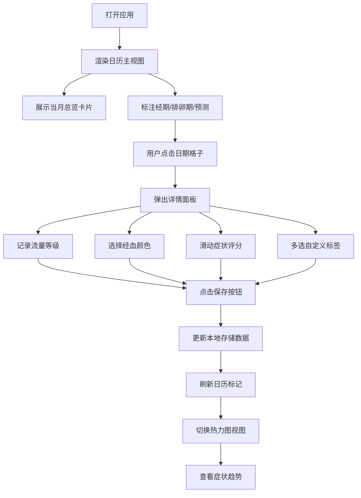

## 1. 产品概述

一款面向女性用户的经期健康管理H5应用，帮助用户直观记录、追踪和分析经期相关数据。通过日历可视化、症状热力图和智能预测功能，让用户深度了解自身生理周期规律，科学管理经期健康。

- 核心目标：提供轻量级、高易用性的经期记录与健康数据分析工具
- 目标用户：有经期健康管理需求的女性群体
- 产品价值：可视化数据呈现 + 智能周期预测 + 症状趋势分析

## 2. 核心功能

### 2.1 用户角色

| 角色 | 注册方式 | 核心权限 |
|------|----------|----------|
| 普通用户 | 无需注册（本地存储） | 记录经期数据、查看历史记录、获取预测分析 |

### 2.2 功能模块

1. **日历主视图**：网格日历、经期/排卵期视觉标记、记录标识、预测标注
2. **日期详情弹窗**：流量等级、经血颜色、症状评分、自定义标签
3. **当月总览卡片**：经期天数、平均周期、痛经评分、环比变化趋势
4. **症状热力图视图**：全月症状总分可视化、经期前后症状高峰标注
5. **智能预测模块**：下次经期预测、排卵窗口预测、误差区间可视化

### 2.3 页面详情

| 页面名称 | 模块名称 | 功能描述 |
|-----------|-------------|---------------------|
| 主页面 | 顶部导航栏 | 月份切换、视图切换（日历/热力图）、今日快捷入口 |
| 主页面 | 当月总览卡片 | 展示持续天数、平均周期、痛经评分及变化趋势，横向可滑动 |
| 主页面 | 日历网格视图 | 7列网格布局，每日格子含经期圆点、排卵期圆点、记录标识小点 |
| 主页面 | 预测标识层 | 日历上层叠加预测经期起始日、排卵窗口、误差区间 |
| 主页面 | 症状热力图视图 | 同网格布局，使用颜色深浅表示症状严重程度 |
| 详情弹窗 | 流量选择器 | 4档流量等级（无/少量/中量/大量），图标+颜色可视化 |
| 详情弹窗 | 颜色选择器 | 5档经血颜色选择（鲜红/暗红/褐色/粉红/咖啡色） |
| 详情弹窗 | 症状评分条 | 痛经/腰酸/头痛/乳房胀痛/情绪波动 5个维度，0-10分滑动评分 |
| 详情弹窗 | 标签选择区 | 预设常用标签多选，支持横向滚动 |
| 详情弹窗 | 操作按钮 | 保存/取消/清除当日记录，底部固定 |

## 3. 核心流程

用户打开应用 → 查看当月日历与总览数据 → 点击目标日期 → 弹出详情面板 → 记录流量/颜色/症状/标签 → 保存 → 日历视图实时更新标记 → 切换至热力图查看症状趋势 → 查看下月预测标记

## 4. 用户界面设计

### 4.1 设计风格

- **主色调**：柔和玫瑰粉 `#FF6B9D` 作为品牌主色，搭配温暖桃粉渐变背景
- **辅助色**：经期深红 `#E63946`、排卵蓝 `#4CC9F0`、症状紫 `#9D4EDD`
- **背景色**：浅粉白渐变 `#FFF5F7 → #FFFFFF`，营造温柔舒适氛围
- **卡片风格**：大圆角（16-24px）、轻阴影（0 4px 20px rgba(255,107,157,0.12)）、磨砂玻璃质感
- **按钮风格**：胶囊形圆角按钮、玫瑰粉渐变填充、按下微缩反馈
- **字体选择**：PingFang SC / HarmonyOS Sans 中文圆润字体体系，标题字重 600，正文 400
- **图标风格**：线性填充结合图标，圆润端点，统一 2px 描边
- **空间氛围**：渐变遮罩、柔和弥散阴影、细腻噪点纹理叠加

### 4.2 页面设计概述

| 页面名称 | 模块名称 | UI 元素 |
|-----------|-------------|-------------|
| 主页面 | 顶部导航栏 | 毛玻璃背景、左右箭头切换月份、中部月份大字展示、右侧视图切换图标按钮 |
| 主页面 | 总览卡片组 | 水平滚动卡片，每张卡片含图标+数值+环比箭头+趋势文案，粉/蓝/紫渐变区分 |
| 主页面 | 日历头部 | 周一行表头（日一二三四五六），灰色小字，周末淡粉高亮 |
| 主页面 | 日历格子 | 正方形格子，日期数字居中，经期红色圆点（4级透明度）、排卵蓝色圆点、底部记录紫色小点 |
| 主页面 | 预测层 | 下次经期半透明红色条纹覆盖、排卵期蓝色虚线边框、误差区间最浅色填充 |
| 主页面 | 热力图视图 | 同尺寸格子，症状总分0-50映射至粉→紫→红渐变填充色 |
| 详情弹窗 | 弹窗容器 | 底部弹出、圆角顶部、向下滑动关闭、背景蒙层模糊 |
| 详情弹窗 | 日期头部 | 大字日期+星期+节日/节气小字标注、左侧关闭按钮 |
| 详情弹窗 | 流量选择 | 4个圆形大按钮（水滴图标+文字），选中态缩放+发光边框 |
| 详情弹窗 | 颜色选择 | 5个色块圆点+文字标签，选中态外圈描边+勾选图标 |
| 详情弹窗 | 症状评分 | 图标+维度名+当前分数+渐变色滑动条，拇指放大交互 |
| 详情弹窗 | 标签区域 | 胶囊形标签横向排列，选中态填充粉色，支持溢出滚动 |
| 详情弹窗 | 底部操作栏 | 左侧清空记录按钮，右侧保存渐变按钮，固定吸底 |

### 4.3 响应式设计

- **移动优先设计**：基准宽度 375px，使用 vw/rem 适配 320px-480px 主流机型
- **栅格系统**：日历使用 CSS Grid，`grid-template-columns: repeat(7, 1fr)`，等分容器宽度
- **触摸优化**：所有可点击元素 ≥ 44×44px，滑动条拇指区域放大至 28px，按钮添加 :active 态缩放
- **安全区域适配**：使用 env(safe-area-inset-bottom) 兼容 iPhone 刘海屏
- **横竖屏适配**：横屏时总览卡片水平排列更宽松，弹窗调整为居中显示而非底部弹出

### 4.4 动效与交互细节

- **页面过渡**：视图切换使用左右滑入动画（300ms cubic-bezier(0.4,0,0.2,1)）
- **弹窗动画**：底部上滑弹出（280ms spring 回弹），背景渐入模糊
- **日历月份切换**：整体向上/向下平移 + 淡入淡出组合
- **保存反馈**：按钮点击缩放 → 加载转圈 → 完成对勾弹出 → 弹窗自动关闭
- **症状评分条**：拖动实时更新颜色渐变，数值跳动数字动效
- **红点标记**：首次加载逐个淡入（staggered 50ms 延迟），营造呼吸感
