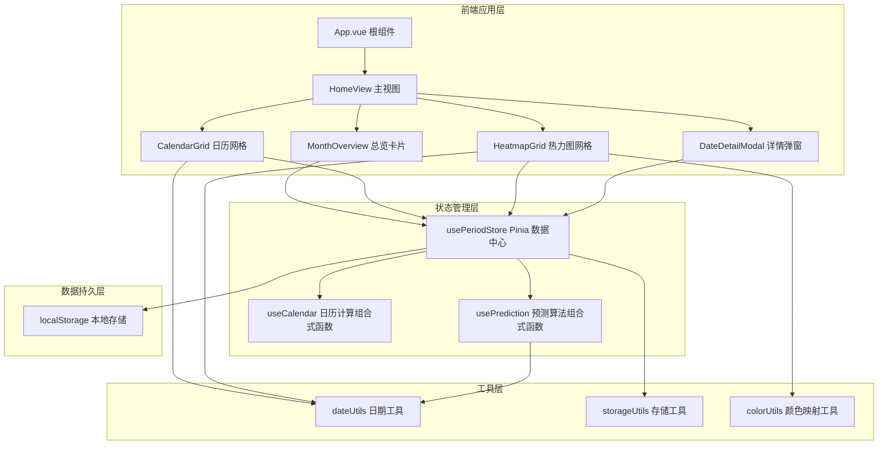
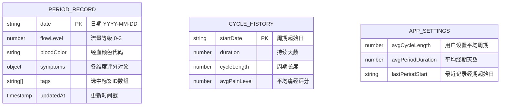

## 1. 架构设计



## 2. 技术选型说明

- **前端框架**：Vue@3.4 + Vite@5 + TypeScript@5
- **构建工具**：Vite（冷启动快、HMR 热更新、按需编译）
- **状态管理**：Pinia@2（Vue3 官方推荐，轻量且 TypeScript 友好）
- **样式方案**：Sass/SCSS + CSS Variables（主题色管理）+ PostCSS（移动端适配）
- **UI 组件库**：Vant@4（移动端 Vue3 组件库，轻量且支持按需引入）
  - 使用组件：Popup、Slider、Tag、Toast、Loading、Icon
- **移动端适配**：postcss-px-to-viewport（px 自动转 vw，基于 375px 设计稿）
- **数据存储**：localStorage + 自定义封装（无需后端，纯前端 H5）
- **日期处理**：dayjs（轻量替代 moment，支持链式调用和中文本地化）
- **动画方案**：Vue Transition 组件 + CSS Keyframes + 贝塞尔曲线自定义缓动

## 3. 路由定义

单页应用，使用 Vue Router 管理视图切换：

| 路由路径 | 组件名称 | 用途 |
|---------|----------|------|
| `/` | HomeView | 主页面，包含日历/热力图视图切换和总览卡片 |

视图间切换通过内部状态管理，不使用路由跳转，保持单页流畅体验。

## 4. 数据模型

### 4.1 实体关系图



### 4.2 TypeScript 类型定义

```typescript
// 单日记录完整结构
interface DayRecord {
  date: string;                          // YYYY-MM-DD 格式
  flowLevel: 0 | 1 | 2 | 3;              // 0无 1少 2中 3多
  bloodColor?: 'bright' | 'dark' | 'brown' | 'pink' | 'coffee';
  symptoms: {
    cramp: number;       // 痛经 0-10
    backache: number;    // 腰酸 0-10
    headache: number;    // 头痛 0-10
    breast: number;      // 乳房胀痛 0-10
    mood: number;        // 情绪波动 0-10
  };
  tags: string[];                         // 标签ID集合
  updatedAt: number;
}

// 月统计数据结构
interface MonthStats {
  year: number;
  month: number;
  periodDays: number;                     // 经期天数
  avgCycleLength: number;                 // 平均周期
  avgPainScore: number;                   // 痛经平均分
  prevPeriodDays: number;                 // 上月经期天数
  prevAvgPainScore: number;               // 上月痛经平均分
  periodChange: number;                   // 经期变化百分比
  painChange: number;                     // 痛经变化百分比
  cycleRegularity: 'improved' | 'stable' | 'declined';
}

// 预测结果结构
interface PredictionResult {
  nextPeriodStart: string;                // 下次经期起始日
  nextPeriodEnd: string;                  // 预计结束日
  periodErrorRange: [string, string];     // 误差区间
  ovulationStart: string;                 // 排卵开始
  ovulationEnd: string;                   // 排卵结束
  ovulationDay: string;                   // 排卵日
  ovulationErrorRange: [string, string];  // 排卵误差区间
}
```

### 4.3 标签常量定义

```typescript
const PRESET_TAGS = [
  { id: 'painkiller', label: '吃了止痛药', icon: '💊' },
  { id: 'ginger_tea', label: '喝了红糖姜茶', icon: '🍵' },
  { id: 'bad_sleep', label: '没睡好', icon: '😴' },
  { id: 'exercise', label: '做了运动', icon: '🏃' },
  { id: 'stress', label: '压力大', icon: '😰' },
  { id: 'cold', label: '受凉了', icon: '🥶' },
  { id: 'spicy', label: '吃了辛辣', icon: '🌶️' },
  { id: 'happy', label: '心情不错', icon: '😊' },
];

const BLOOD_COLORS = [
  { id: 'bright', label: '鲜红色', color: '#FF3B30' },
  { id: 'dark', label: '暗红色', color: '#B71C1C' },
  { id: 'brown', label: '褐色', color: '#795548' },
  { id: 'pink', label: '粉红色', color: '#FF80AB' },
  { id: 'coffee', label: '咖啡色', color: '#5D4037' },
];

const FLOW_LEVELS = [
  { level: 0, label: '无', alpha: 0, hint: '非经期' },
  { level: 1, label: '少量', alpha: 0.4, hint: '点滴状' },
  { level: 2, label: '中量', alpha: 0.7, hint: '正常量' },
  { level: 3, label: '大量', alpha: 1.0, hint: '需频繁更换' },
];
```

### 4.4 本地存储键名规范

| Key | 数据类型 | 说明 |
|-----|---------|------|
| `period:records` | `Record<string, DayRecord>` | 按日期索引的全部记录 |
| `period:settings` | `AppSettings` | 用户设置与周期参数 |
| `period:history` | `CycleHistory[]` | 历史周期汇总数据 |

## 5. 核心算法设计

### 5.1 日历生成算法

输入：目标年份、目标月份  
输出：6行×7列共42个格子数据（含首尾补全的前后月日期）

```
1. 获取当月第一天 DayOfWeek
2. 计算需要前置填充的上月日期数量 = firstDayOfWeek
3. 计算当月总天数 daysInMonth
4. 补足42格所需的下月日期 = 42 - 前置 - 当月天数
5. 遍历生成所有格子，标记 isCurrentMonth/isToday/isPeriodDay 等
6. 对每个格子调用 getDayMarkers 获取视觉标记配置
```

### 5.2 周期预测算法（基于最近3个周期平均）

```
输入：历史周期历史记录、最近经期起始日、平均周期长度常量
输出：PredictionResult 对象

步骤：
1. 若历史记录 ≥ 3，取最近3个周期长度算加权平均（越近权重越高）
   cycleAvg = 0.5 * last + 0.3 * prev + 0.2 * prev2
2. 若历史记录不足，使用默认值 28 天
3. 下次经期起始日 = lastPeriodStart + cycleAvg
4. 经期结束日 = 起始日 + avgPeriodDuration - 1
5. 排卵日 = 下次经期起始日 - 14天
6. 排卵期 = 排卵日前5天 至 排卵日后4天（共10天易孕期）
7. 误差区间 = ±2天 包裹预测
```

### 5.3 症状总分 → 热力图颜色映射

```
症状总分 range: 0 ~ 50（5维度 × 10分）
使用 HSL 色系渐变色带：
  0-10:   HSL(350, 70%, 95%)  极浅粉（基本无症状）
  10-20:  HSL(340, 75%, 85%)  浅粉
  20-30:  HSL(330, 80%, 72%)  中粉
  30-40:  HSL(320, 80%, 58%)  深粉紫
  40-50:  HSL(350, 85%, 50%)  深红（症状严重）
```

### 5.4 排卵期识别（用于日历标记）

```
对所有日期判断：
1. isOvulationDay = 日期是否等于 prediction.ovulationDay
2. isOvulationWindow = 在 ovulationStart 到 ovulationEnd 区间
3. 预测排卵日用实心蓝圆点，窗口用淡蓝色调填充背景
```

## 6. 组件分层与职责

| 组件路径 | 组件名 | 输入 Props | 输出 Emits | 核心职责 |
|--------|--------|-----------|-----------|---------|
| `components/` | `AppHeader` | currentMonth, viewMode | change-month, change-view | 顶部导航月份切换、视图模式切换 |
| `components/` | `MonthOverview` | stats: MonthStats | - | 渲染3张统计卡片、环比变化、趋势箭头 |
| `components/` | `CalendarGrid` | cells, prediction, records | select-date | 7×6网格渲染、经期/排卵/记录标记叠层、点击事件 |
| `components/` | `HeatmapGrid` | cells, records | select-date | 热力图着色渲染、单元格悬浮提示总分 |
| `components/` | `DateCell` | cell, markers, heatmapColor | click | 单个格子渲染、圆点位置、大小透明度控制 |
| `components/` | `DateDetailModal` | visible, date, record | save, cancel, clear | 弹窗容器、表单收集、症状滑块、标签选择 |
| `components/` | `FlowPicker` | modelValue: number | update:modelValue | 4档流量图标选择器 |
| `components/` | `ColorPicker` | modelValue: string | update:modelValue | 5档经血颜色圆选择器 |
| `components/` | `SymptomSliders` | modelValue: SymptomObj | update:modelValue | 5维度评分滑块组 |
| `components/` | `TagSelector` | options, modelValue | update:modelValue | 胶囊形多选标签 |
| `composables/` | `useCalendar.ts` | year, month, recordMap | 日历格子数组、辅助函数 | 日历生成算法封装 |
| `composables/` | `usePrediction.ts` | history, settings | PredictionResult | 周期预测算法封装 |
| `composables/` | `usePeriodStore.ts` | - | - | Pinia 全局状态，数据CRUD、持久化 |
| `utils/` | `date.ts` | - | - | 日期格式化、差值计算、范围判定工具 |
| `utils/` | `color.ts` | - | - | 流量颜色透明度、热力图渐变色映射 |
